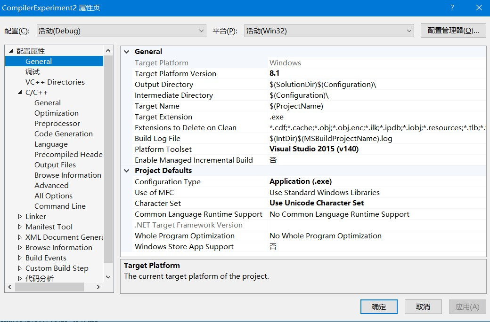
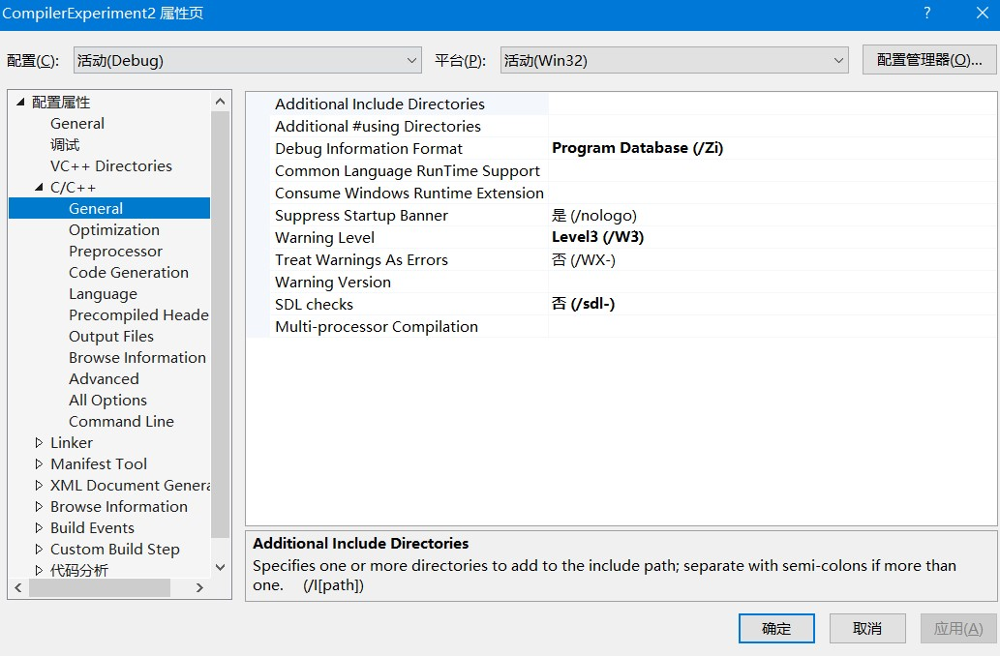

## 编译原理语法分析

代码中包含注释，请仔细阅读

新建项目的化，需要 

1. 平台选择8.1
2. 编译器选择2015
3. 否 `-sdl`
4. `/ZI` 到`/Zi`





## 附件

#### 1. parser.y详解

```yacc

/*parser.y
 *
 *bison输入文件，用于产生parser
 *
 *pp2:你的任务只是输出parser的规约动作，即只需要验证输入文件是否符合
 *decaf语言的文法，并把规约动作输出。
 *
*/
%{

/*
 *同flex一样，第一个%{ %}内部的程序将被直接copy到parser_tab.h/c中
 *所以可以将要include的头文件和全局变量放到这儿。
*/
#include <stdio.h>
#include <stdlib.h>
#include <malloc.h>
#include <process.h>	
#include <stdarg.h>
#include "scanner.h"
#include "AST.h"
#include "hashtable.h"

// 定义ast root
extern struct ast* root;
// 声明map
map_t map;
// 声明buildAST(可变参)
struct ast* buildAST(char* rootKey, int n, ...);
// 声明判断终结符, c中没有bool，用0或非0表示
int isTermination(char* key);

%}

/*
 *在这儿，你可以定义tokens,types,precedence 和 associativity等。
*/

/*
 *从program开始规约
*/
%start Program

/*
 *yylval
 *------
 *这儿定义全局变量yylval，你可以添加自己的非终结符。
*/
%union {			/*bison可以从这个定义中产生yylval的定义 union表示在parser中，给每个节点都创造了一个这样的结构体，供用户使用*/
  int integerConstant;
  int boolConstant;
  const char *stringConstant;
  double doubleConstant;
  char identifier[128];
  struct ast* a;   /* 添加ast */
}

/*Tokens
 *------
 *这儿我们告诉bison所要用到的token类型。
 *bison可以给这些类型定义唯一的数字并输出#define 到parser_tab.h文件中。
*/
%token T_Void T_Bool T_Int T_Double T_String T_Class 
%token T_LessEqual T_GreaterEqual T_Equal T_NotEqual
%token T_And T_Or T_Null T_Extends T_This
%token T_While T_For T_If T_Else T_Return T_Break
%token T_Identifier
%token T_StringConstant T_IntConstant T_DoubleConstant T_BoolConstant
%token T_New T_NewArray T_Print T_ReadInteger T_ReadLine

%left ','
%left T_Or
%left T_And
%left T_Equal T_NotEqual
%left T_LessEqual T_GreaterEqual '>' '<'
%left '+' '-'
%left '/' '*' '%'
%right '!' UMINUS
%left '[' ']' '(' ')' '.'

/*Precedence and Associativity
 *----------------------------
 *定义算符优先级和结合性
 *Note: NO SPACE between % and nonassoc, left, right!!!!!
*/


/*
 * %type <a> 表示：在哪些节点的union中，挑出来a这个参数名，赋值给默认参数$$（即$$是a代表的类型）
 * 要构建ast， 就把除了终结符外的全部token都用a来赋值
 * 在parser_tab.c中，可以看到如下语句 yyval.a = buildAST("DeclList", 2, "DeclList", "Decl");
 * 而yyval就是上述union定义的数据结构
 */
%type <a> Program DeclList Decl VariableDecl Variable Type FunctionDecl Formals 
%type <a> VariableList FunctionDefn ClassDefn OptExtends FieldList Field StmtBlock StmtList Stmt SimpleStmt
%type <a> LValue Call OptReceiver Actuals ExprList ForStmt WhileStmt IfStmt OptElse ReturnStmt PrintStmt
%type <a> BoolExpr Expr Constant
%%
/*
 *在这儿写出你的规则和动作
 * 在这里我编写的建树方法是： （递归的思想）
 * 对于每一句规约  A -> B C ...
 * 根据自底向上，B C ... 肯定已经访问到了（也就是已经建立ast节点了）
 * 那么如何找出B 和 C的ast节点呢，我的解决办法是，**用一个map来保存*建立过但未成为子节点*的astnode**。
 * 具体的：（struct ast* buildAST(..);）
 * 每次的规约语句， -> 右端的，从map中获取，如果有有则获取后就remove，因为使用过了，如果没有，则新建node
 * 然后由从 -> 右侧获取的node，与 -> 左侧的 新建的ast根， 做子节点的连接。
 * 最后把root加入map
 
 * 这样每次从右侧获取没被使用的node，然后与左侧节点连接；经过自底向上，就能获得整颗ast的root
*/

/* 在这里，我推测构建ast有一种更简单也更正确的方式，即 $$ = build($1, $2..)
因为是自底向上构建，多以$1是绝对已经构建完毕的，**也不会出现乱序或节点丢失的情况**，
在这个方法中，构建数真正的和parser的过程结合起来了，每次子节点都是由parser保证正确的
这种方法就不需要map
*/

Program      :  DeclList
				{ printf("Program -> DeclList\n");
				  /* $$ = build($1, $2..) */
				  $$ = buildAST("Program", 1, "DeclList");
				  root = $$;
				  @1
				}
             ;

DeclList     :  DeclList Decl
				{ printf("DeclList -> DeclList Decl\n");
				  $$ = buildAST("DeclList", 2, "DeclList", "Decl");
				}
             |  /* empty */
             	{ printf("DeclList ->\n"); 
				  $$ = buildAST("DeclList", 1, "null");
				}
             ;
	     
Decl         :  FunctionDecl
				{ printf("Decl -> FunctionDecl\n");
				  $$ = buildAST("Decl", 1, "FunctionDecl");
				}
             |  FunctionDefn
				{ printf("Decl -> FunctionDefn\n");
				  $$ = buildAST("Decl", 1, "FunctionDefn");
				}
             |  ClassDefn
				{ printf("Decl -> ClassDefn\n");
				  $$ = buildAST("Decl", 1, "ClassDefn");
				}
             |  VariableDecl
                { printf("Decl -> VaruableDecl\n");
				  $$ = buildAST("Decl", 1, "VariableDecl");
				}
             ;

VariableDecl :  Variable ';'
                { printf("VariableDecl -> Variable ;\n");
				  $$ = buildAST("VariableDecl", 2, "Variable", ";");
				}
             ;

Variable     :  Type T_Identifier
                { printf("Variable -> Type identifier\n");
				  $$ = buildAST("Variable", 2, "Type", "identifier");
				}
             ;

Type         :  T_Int
                { printf("Type -> int\n");
				  $$ = buildAST("Type", 1, "int");
				}
             |  T_Double
				{ printf("Type -> double\n");
				  $$ = buildAST("Type", 1, "double");
				}
			 |  T_Bool
				{ printf("Type -> bool\n");
				  $$ = buildAST("Type", 1, "bool");
				}
			 |  T_String
				{ printf("Type -> string\n");
				  $$ = buildAST("Type", 1, "string");
				}
			 |  T_Void
				{ printf("Type -> void\n");
				  $$ = buildAST("Type", 1, "void");
				}
			 |  T_Class T_Identifier
				{ printf("Type -> class identifier\n");
				  $$ = buildAST("Type", 2, "class", "identifier");
				}
			 |  Type '[' ']'
				{ printf("Type -> Type []\n");
				  $$ = buildAST("Type", 3, "Type", "[", "]");
				}
             ;

FunctionDecl :  Type T_Identifier '(' Formals ')' ';'
                { printf("FunctionDecl -> Type identifier ( Formals ) ;\n");
				  $$ = buildAST("FunctionDecl", 6, "Type", "identifier", "(", "Formals", ")", ";");
				}
             ;

Formals      :  VariableList
                { printf("Formals -> VariableList \n");
				  $$ = buildAST("Formals", 1, "VariableList");
				}
			 |  /* empty */
				{ printf("Formals -> \n");
				  $$ = buildAST("Formals", 1, "null");
				}
			 ;

VariableList :  VariableList ',' Variable
                { printf("VariableList -> VariableList , Variable\n");
				  $$ = buildAST("VariableList", 3, "VariableList", ",", "Variable");
				}
			 |  Variable
				{ printf("VariableList -> Variable\n");
				  $$ = buildAST("VariableList", 1, "Variable");
				}
             ;

FunctionDefn :  Type T_Identifier '(' Formals ')' StmtBlock
                { printf("FunctionDefn -> Type identifier ( Formals ) StmtBlock\n");
				  $$ = buildAST("FunctionDefn", 6, "Type", "identifier", "(", "Formals", ")", "StmtBlock");
				}
             ;

ClassDefn    :  T_Class T_Identifier OptExtends '{' FieldList '}'
                { printf("ClassDefn -> class identifier OptExtends { FieldList } \n");
				  $$ = buildAST("ClassDefn", 6, "class", "identifier", "OptExtends", "{", "FieldList", "}");
				}
             ;

OptExtends   :  T_Extends T_Identifier
			   { printf("OptExtends -> extends identifier\n");
			     $$ = buildAST("OptExtends", 2, "extends", "identifier");
			   }
			 | /* empty */
			   { printf("OptExtends -> \n");
			     $$ = buildAST("OptExtends", 1, "null");
			   }
			 ;

FieldList    :  FieldList Field
                { printf("FieldList -> FieldList Field\n");
				  $$ = buildAST("FieldList", 2, "FieldList", "Field");
				}
             |  /* empty */
			    { printf("FieldList -> \n");
				  $$ = buildAST("FieldList", 1, "null");
				}
             ;

Field        :  VariableDecl
                { printf("Field -> VariableDecl\n");
				  $$ = buildAST("Field", 1, "VariableDecl");
				}
             |  FunctionDecl
				{ printf("Field -> FunctionDecl\n");
				  $$ = buildAST("Field", 1, "FunctionDecl");
				}
			 |  FunctionDefn
				{ printf("Field -> FunctionDefn\n");
				  $$ = buildAST("Field", 1, "FunctionDefn");
				}
			 ;

StmtBlock    :  '{' StmtList '}'
                { printf("StmtBlock -> { StmtList } \n");
				  $$ = buildAST("StmtBlock", 3, "{", "StmtList", "}");
				}
			 ;

StmtList     :  StmtList Stmt
                { printf("StmtList -> StmtList Stmt\n");
				  $$ = buildAST("StmtList", 2, "StmtList", "Stmt");
				}
			 |  /* empty */
				{ printf("StmtList ->\n");
				  $$ = buildAST("StmtList", 1, "null");
				}
             ;

Stmt         :  VariableDecl
                { printf("Stmt -> VariableDecl\n");
				  $$ = buildAST("Stmt", 1, "VariableDecl");
				}
			 |  SimpleStmt ';'
				{ printf("Stmt -> SimpleStmt ;\n");
				  $$ = buildAST("Stmt", 2, "SimpleStmt", ";");
				}
			 |  IfStmt
				{ printf("Stmt -> IfStmt\n");
				  $$ = buildAST("Stmt", 1, "IfStmt");
				}
             |  WhileStmt
				{ printf("Stmt -> WhileStmt\n");
				  $$ = buildAST("Stmt", 1, "WhileStmt");
				}
             |  ForStmt
			    { printf("Stmt -> ForStmt\n");
				  $$ = buildAST("Stmt", 1, "ForStmt");
				}
             |  ReturnStmt ';'
				{ printf("Stmt -> ReturnStmt ;\n");
				  $$ = buildAST("Stmt", 2, "ReturnStmt", ";");
				}
			 |  PrintStmt ';'
				{ printf("Stmt -> PrintStmt ;\n");
				  $$ = buildAST("Stmt", 2, "PrintStmt", ";");
				}
			 |  StmtBlock 
				{ printf("Stmt -> StmtBlock\n");
				  $$ = buildAST("Stmt", 1, "StmtBlock");
				}
             ;

SimpleStmt   :  LValue '=' Expr
                { printf("SimpleStmt -> LValue = Expr\n");
				  $$ = buildAST("SimpleStmt", 3, "LValue", "=", "Expr");
				}
             |  Expr
				{ printf("SimpleStmt -> Expr\n");
				  $$ = buildAST("SimpleStmt", 1, "Expr");
				}
             |  /* empty */
				{ printf("SimpleStmt -> \n");
				  $$ = buildAST("SimpleStmt", 1, "null");
				}
             ;

LValue       :  OptReceiver T_Identifier
                { printf("LValue -> OptReceiver identifier\n");
				  $$ = buildAST("LValue", 2, "OptReceiver", "identifier");
				}
             |  Expr '[' Expr ']'
				{ printf("LValue -> Expr [ Expr ] \n");
				  $$ = buildAST("LValue", 4, "Expr", "[", "Expr", "]");
				}
             ;

Call         :  OptReceiver T_Identifier '(' Actuals ')'
                { printf("Call -> OptReceiver identifier ( Actuals )\n");
				  $$ = buildAST("Call", 5, "OptReceiver", "identifier", "(", "Actuals", ")");
				}
             ;

OptReceiver  : Expr '.'
				{ printf("OptReceiver -> Expr .\n");
				  $$ = buildAST("OptReceiver", 2, "Expr", ".");
				}
			 | /*empty*/
			   { printf("OptReceiver -> \n");
			     $$ = buildAST("OptReceiver", 1, "null");
			   }
			 ;

Actuals      :  ExprList
                { printf("Actuals -> ExprList\n");
				  $$ = buildAST("Actuals", 1, "ExprList");
				}
             |  /* empty */
				{ printf("Actuals -> \n");
				  $$ = buildAST("Actuals", 1, "null");
				}
             ;

ExprList     :  ExprList ',' Expr
                { printf("ExprList -> ExprList , Expr\n");
				  $$ = buildAST("ExprList", 3, "ExprList", ",", "Expr");
				}
			 |  Expr
				{ printf("ExprList -> Expr\n");
				  $$ = buildAST("ExprList", 1, "Expr");
				}
			 ;

ForStmt      :  T_For '(' SimpleStmt ';' BoolExpr ';' SimpleStmt ')' Stmt
                { printf("ForStmt -> for ( SimpleStmt ; BoolExpr ; SimpleStmt ) Stmt \n");
				  $$ = buildAST("ForStmt", 9, "for", "(", "SimpleStmt", ";", "BoolExpr", ";", "SimpleStmt", ")", "Stmt");
				}
             ;

WhileStmt    :  T_While '(' BoolExpr ')' Stmt
                { printf("WhileStmt -> while( BoolExpr ) Stmt \n");
				  $$ = buildAST("WhileStmt", 5, "while", "(", "BoolExpr", ")", "Stmt");
				}
             ;

IfStmt       :  T_If '(' BoolExpr ')' Stmt OptElse
                { printf("IfStmt -> if ( BoolExpr ) Stmt OptElse \n");
				  $$ = buildAST("IfStmt", 6, "if", "(", "BoolExpr", ")", "Stmt", "OptElse");
				}
             ;

OptElse      :  T_Else Stmt
                { printf("OptElse -> else Stmt\n");
				  $$ = buildAST("OptElse", 2, "else", "Stmt");
				}
			 |  /* empty */
				{ printf("OptElse -> \n");
				  $$ = buildAST("OptElse", 1, "null");
				}
			 ;

ReturnStmt   :  T_Return
                { printf("ReturnStmt -> return\n");
				  $$ = buildAST("ReturnStmt", 1, "retuen");
				}
             |  T_Return Expr
				{ printf("ReturnStmt -> return Expr \n");
				  $$ = buildAST("ReturnStmt", 2, "return", "Expr");
				}
			 ;

PrintStmt    :  T_Print '(' ExprList ')'
                { printf("PrintStmt -> print ( ExprList ) \n");
				  $$ = buildAST("PrintStmt", 4, "print", "(", "ExprList", ")");
				}
             ;

BoolExpr     :  Expr
                { printf("BoolExpr -> Expr\n");
				  $$ = buildAST("BoolExpr", 1, "Expr");
				}
             ;

Expr         :  Constant
                { printf("Expr -> Constant\n");
				  $$ = buildAST("Expr", 1, "Constant");
				}
             |  LValue
				{ printf("Expr -> LValue\n");
				 $$ = buildAST("Expr", 1, "LValue");
				}
             |  T_This
				{ printf("Expr -> this\n");
				  $$ = buildAST("Expr", 1, "this");
				}
             |  Call
				{ printf("Expr -> Call\n");
				  $$ = buildAST("Expr", 1, "Call");
				}
             |  '(' Expr ')'
				{ printf("Expr -> ( Expr ) \n");
				  $$ = buildAST("Expr", 3, "(", "Expr", ")");
				}
             |  Expr '+' Expr
				{ printf("Expr -> Expr + Expr \n");
				  $$ = buildAST("Expr", 3, "Expr", "+", "Expr");
				}
             |  Expr '-' Expr
				{ printf("Expr -> Expr - Expr \n");
				  $$ = buildAST("Expr", 3, "Expr", "-", "Expr");
				}
             |  Expr '*' Expr
				{ printf("Expr -> Expr * Expr \n");
				  $$ = buildAST("Expr", 3, "Expr", "*", "Expr");
				}
			 |  Expr '/' Expr
				{ printf("Expr -> Expr / Expr \n");
				  $$ = buildAST("Expr", 3, "Expr", "/", "Expr");
				}
             |  Expr '%' Expr
				{ printf("Expr -> Expr %% Expr \n");
				  $$ = buildAST("Expr", 3, "Expr", "%", "Expr");
				}
			 |  '-' Expr %prec UMINUS
				{ printf("Expr -> - Expr \n");
				  $$ = buildAST("Expr", 2, "-", "Expr");
				}
             |  Expr '<' Expr
				{ printf("Expr -> Expr < Expr \n");
				  $$ = buildAST("Expr", 3, "Expr", "<", "Expr");
				}
             |  Expr T_LessEqual Expr
				{ printf("Expr -> Expr <= Expr \n");
				  $$ = buildAST("Expr", 3, "Expr", "<=", "Expr");
				}
			 |  Expr '>' Expr
				{ printf("Expr -> Expr > Expr \n");
				  $$ = buildAST("Expr", 3, "Expr", ">", "Expr");
				}
             |  Expr T_GreaterEqual Expr
				{ printf("Expr -> Expr >= Expr\n");
				  $$ = buildAST("Expr", 3, "Expr", ">=", "Expr");
				}
             |  Expr T_Equal Expr
				{ printf("Expr -> Expr == Expr \n");
				  $$ = buildAST("Expr", 3, "Expr", "==", "Expr");
				}
             |  Expr T_NotEqual Expr
				{ printf("Expr -> Expr != Expr \n");
				  $$ = buildAST("Expr", 3, "Expr", "!=", "Expr");
				}
			 |  Expr T_And Expr
				{ printf("Expr -> Expr && Expr \n");
				  $$ = buildAST("Expr", 3, "Expr", "&&", "Expr");
				}
			 |  Expr T_Or Expr
				{ printf("Expr -> Expr || Expr \n");
				  $$ = buildAST("Expr", 3, "Expr", "||", "Expr");
				}
		     |  '!' Expr
				{ printf("Expr -> ! Expr \n");
				  $$ = buildAST("Expr", 2, "!", "Expr");
				}
			 |  T_ReadInteger '(' ')'
				{ printf("Expr -> ReadInteger ( ) \n");
				  $$ = buildAST("Expr", 3, "readInteger", "(", ")");
				}
			 |  T_ReadLine '(' ')'
				{ printf("Expr -> ReadLine ( ) \n");
				  $$ = buildAST("Expr", 3, "readLine", "(", ")");
				}
			 |  T_New '(' T_Identifier ')'
				{ printf("Expr -> New ( identifier ) \n");
				  $$ = buildAST("Expr", 4, "new", "(", "identifier", ")");
				}
			 |  T_NewArray '(' Expr ',' Type ')'
				{ printf("Expr -> NewArray ( Expr , Type )\n");
				  $$ = buildAST("Expr", 6, "newArray", "(", "Expr", ",", "Type", ")");
				}
             ;

Constant     :  T_IntConstant
                { printf("Constant -> intConstant\n");
				  $$ = buildAST("Constant", 1, "intConstant");
				}
             |  T_DoubleConstant
				{ printf("Constant -> doubleConstant\n");
				  $$ = buildAST("Constant", 1, "doubleConstant");
				}
             |  T_BoolConstant
				{ printf("Constant -> boolConstant\n");
				  $$ = buildAST("Constant", 1, "boolConstant");
				}
			 |  T_StringConstant
				{ printf("Constant -> stringConstant\n");
				  $$ = buildAST("Constant", 1, "stringConstant");
				}
			 |  T_Null
				{ printf("Constant -> null\n");
				  $$ = buildAST("Constant", 1, "null");
				}
             ;

%% 
/*
 *语法规则到此为止。
 *以下是你自己定义的函数，这些函数将会直接被copy到parser_tab.c文件中，
 *如果你需要一些辅助的函数，可以写到这儿。
*/
void Inityyparse(void) {
}
/**
 * 构建ast，map存储最近使用过的标识
 * Variable -> Type identifier 的语句中， 每次在map中寻找 -> 右边 的记号，如果存在就remove，然后构建ast，并将 -> 左边的根put到map
 * 这样做的原因是， bison是LALR(1) 自底向上分析，因此右侧记号是先识别出来的
 */
/*
变长参数传递，引入 <stdarg.h>头文件
rootKey表示astroot的val，n表示后续几个子节点，... 是ast类型数组
*/
struct ast* buildAST(char* rootKey, int n, ...) {
	struct ast* root = newAST(rootKey);
	// 创建局部数据，存放变长数组
	va_list valist;
	// 设置长度
	va_start(valist, n);
	for (int i = 0; i < n; i++) {
		// 获取一个节点
		char* key = va_arg(valist, char*);
		if (!isTermination(key)) {
		// 非终结符，先尝试从map获取
			struct ast* a = hashmap_get(map, key);
			if (a == NULL) {
				a = newAST(key);
				addChild(root, a);
			}
			else {
			// 获取成功，remove，addchild
				addChild(root, a);
				hashmap_remove(map, key);
			}
		} else {
		// 终结符，新建节点，add
			struct ast* a = newAST(key);
			addChild(root, a);
		}
	}
	// root放入map
	hashmap_put(map, rootKey, root);
	// 释放局部数组
	va_end(valist);
	return root;
}

int isTermination(char* key) {
	if (sizeof(key) > 3) {
		if (key[0] <= 'z' && key[0] >= 'a') return 1; 
		else return 0;
	}
	return 1;
}


```

#### 2. 运行

```shell
修改parser,y
debug.bat
VS执行main.c
dot -Tpng -o example.png example.dot
```

#### 3. 参考

flex与bison

[[003-词法解析(flex)和语法解析(bison)](https://my.oschina.net/Greedxuji/blog/4275989)](https://my.oschina.net/Greedxuji/blog/4275989)

[使用自动化语法分析工具BISON](https://blog.csdn.net/weixin_34221073/article/details/92307371)

[c_hashmap](https://github.com/petewarden/c_hashmap)

[c++_graphviz](https://github.com/sjsimps/Graphviz-Utility)

[在Visual Studio 2019中修改项目名](https://blog.csdn.net/wml00000/article/details/104209106)

[如何用C语言封装 C++的类，在 C里面使用](https://blog.csdn.net/caspiansea/article/details/9676153)

#### 4. parser.y 详解

附件1的`parser.y`中提到存在一种新的可能性

>  在这里，我推测构建`ast`有一种更简单也更正确的方式，即 `$$ = build($1, $2..)`
> 因为是自底向上构建，所以`$1`是绝对已经构建完毕的，**也不会出现乱序或节点丢失的情况**，
> 在这个方法中，构建树真正的和parser的过程结合起来了，每次子节点都是由parser保证正确的
> 这种方法就不需要map

经过尝试后，证明能够正确的产生`ast`。同时，发现附件1的parser.y产生的是语法分析树，并不是抽象语法树，经过修改，现能用以中更为简介也更为正确的方式产生`ast`。同时需要修改`AST.c` `addChild`方法的一部分。

```c
if (root == NULL || child == NULL) {
    return;
}
```

```yacc
/*parser.y 详见readme.md
 *
 *bison输入文件，用于产生parser
 *
 *pp2:你的任务只是输出parser的规约动作，即只需要验证输入文件是否符合
 *decaf语言的文法，并把规约动作输出。
 *
*/
%{

/*
 *同flex一样，第一个%{ %}内部的程序将被直接copy到parser_tab.h/c中
 *所以可以将要include的头文件和全局变量放到这儿。
*/
#include <stdio.h>
#include <stdlib.h>
#include <malloc.h>
#include <process.h>	
#include <stdarg.h>
#include "scanner.h"
#include "AST.h"
#include "hashtable.h"

// 定义ast root
extern struct ast* root;
// 声明map
map_t map;
// 声明buildAST(可变参)
struct ast* buildAST(char* rootKey, int n, ...);
// 声明判断终结符, c中没有bool，用0或非0表示
int isTermination(char* key);

%}

/*
 *在这儿，你可以定义tokens,types,precedence 和 associativity等。
*/

/*
 *从program开始规约
*/
%start Program

/*
 *yylval
 *------
 *这儿定义全局变量yylval，你可以添加自己的非终结符。
*/
%union {			/*bison可以从这个定义中产生yylval的定义 union表示在parser中，给每个节点都创造了一个这样的结构体，供用户使用*/
  int integerConstant;
  int boolConstant;
  const char *stringConstant;
  double doubleConstant;
  char identifier[128];
  struct ast* a;   /* 添加ast */
}

/*Tokens
 *------
 *这儿我们告诉bison所要用到的token类型。
 *bison可以给这些类型定义唯一的数字并输出#define 到parser_tab.h文件中。
*/
%token T_Void T_Bool T_Int T_Double T_String T_Class 
%token T_LessEqual T_GreaterEqual T_Equal T_NotEqual
%token T_And T_Or T_Null T_Extends T_This
%token T_While T_For T_If T_Else T_Return T_Break
%token T_Identifier
%token T_StringConstant T_IntConstant T_DoubleConstant T_BoolConstant
%token T_New T_NewArray T_Print T_ReadInteger T_ReadLine

%left ','
%left T_Or
%left T_And
%left T_Equal T_NotEqual
%left T_LessEqual T_GreaterEqual '>' '<'
%left '+' '-'
%left '/' '*' '%'
%right '!' UMINUS
%left '[' ']' '(' ')' '.'

/*Precedence and Associativity
 *----------------------------
 *定义算符优先级和结合性
 *Note: NO SPACE between % and nonassoc, left, right!!!!!
*/


/*
 * %type <a> 表示：在哪些节点的union中，挑出来a这个参数名，赋值给默认参数$$（即$$是a代表的类型）
 * 要构建ast， 就把除了终结符外的全部token都用a来赋值
 * 在parser_tab.c中，可以看到如下语句 yyval.a = buildAST("DeclList", 2, "DeclList", "Decl");
 * 而yyval就是上述union定义的数据结构
 */
%type <a> Program DeclList Decl VariableDecl Variable Type FunctionDecl Formals 
%type <a> VariableList FunctionDefn ClassDefn OptExtends FieldList Field StmtBlock StmtList Stmt SimpleStmt
%type <a> LValue Call OptReceiver Actuals ExprList ForStmt WhileStmt IfStmt OptElse ReturnStmt PrintStmt
%type <a> BoolExpr Expr Constant
%%
/*
 *在这儿写出你的规则和动作
*/

Program      :  DeclList
				{ printf("Program -> DeclList\n");
				  /* 对于产生式右端只有一个的情况， 如果是终结符，则newAST(".."), 否则直接 $$ = $1*/
				  $$ = $1;
				  root = $$;
				  @1
				}
             ;

DeclList     :  DeclList Decl
				{ printf("DeclList -> DeclList Decl\n");
				/* 对于产生式右端有多个的情况，$$ = buildAST(char* rootKey, int n, ... struct ast* ...)*/
				  $$ = buildAST("DeclList", 2, $1, $2);
				}
             |  /* empty */
             	{ printf("DeclList ->\n"); 
             	/* 对于产生式右端为空的情况， 直接 $$ = NULL。下面所有情况相同*/
				  $$ = NULL;
				}
             ;
	     
Decl         :  FunctionDecl
				{ printf("Decl -> FunctionDecl\n");
				  $$ = $1;
				}
             |  FunctionDefn
				{ printf("Decl -> FunctionDefn\n");
				  $$ = $1;
				}
             |  ClassDefn
				{ printf("Decl -> ClassDefn\n");
				  $$ = $1;
				}
             |  VariableDecl
                { printf("Decl -> VaruableDecl\n");
				  $$ = $1;
				}
             ;

VariableDecl :  Variable ';'
                { printf("VariableDecl -> Variable ;\n");
				  $$ = buildAST("VariableDecl", 2, $1, newAST(";"));
				}
             ;

Variable     :  Type T_Identifier
                { printf("Variable -> Type identifier\n");
				  $$ = buildAST("Variable", 2, $1, newAST("identifier"));
				}
             ;

Type         :  T_Int
                { printf("Type -> int\n");
				  $$ = newAST("int");
				}
             |  T_Double
				{ printf("Type -> double\n");
				  $$ = newAST("double");
				}
			 |  T_Bool
				{ printf("Type -> bool\n");
				  $$ = newAST("bool");
				}
			 |  T_String
				{ printf("Type -> string\n");
				  $$ = newAST("string");
				}
			 |  T_Void
				{ printf("Type -> void\n");
				  $$ = newAST("void");
				}
			 |  T_Class T_Identifier
				{ printf("Type -> class identifier\n");
				  $$ = buildAST("Type", 2, newAST("class"), newAST("identifier"));
				}
			 |  Type '[' ']'
				{ printf("Type -> Type []\n");
				  $$ = buildAST("Type", 3, $1, newAST("["), newAST("]"));
				}
             ;

FunctionDecl :  Type T_Identifier '(' Formals ')' ';'
                { printf("FunctionDecl -> Type identifier ( Formals ) ;\n");
				  $$ = buildAST("FunctionDecl", 6, $1, newAST("identifier"), newAST("("), $4, newAST(")"), newAST(";"));
				}
             ;

Formals      :  VariableList
                { printf("Formals -> VariableList \n");
				  $$ = $1;
				}
			 |  /* empty */
				{ printf("Formals -> \n");
				  $$ = NULL;
				}
			 ;

VariableList :  VariableList ',' Variable
                { printf("VariableList -> VariableList , Variable\n");
				  $$ = buildAST("VariableList", 3, $1, newAST(","), $3);
				}
			 |  Variable
				{ printf("VariableList -> Variable\n");
				  $$ = $1;
				}
             ;

FunctionDefn :  Type T_Identifier '(' Formals ')' StmtBlock
                { printf("FunctionDefn -> Type identifier ( Formals ) StmtBlock\n");
				  $$ = buildAST("FunctionDefn", 6, $1, newAST("identifier"), newAST("("), $4, newAST(")"), $6);
				}
             ;

ClassDefn    :  T_Class T_Identifier OptExtends '{' FieldList '}'
                { printf("ClassDefn -> class identifier OptExtends { FieldList } \n");
				  $$ = buildAST("ClassDefn", 6, newAST("class"), newAST("identifier"), $3, newAST("{"), $5, newAST("}"));
				}
             ;

OptExtends   :  T_Extends T_Identifier
			   { printf("OptExtends -> extends identifier\n");
			     $$ = buildAST("OptExtends", 2, newAST("extends"), newAST("identifier"));
			   }
			 | /* empty */
			   { printf("OptExtends -> \n");
			     $$ = NULL;
			   }
			 ;

FieldList    :  FieldList Field
                { printf("FieldList -> FieldList Field\n");
				  $$ = buildAST("FieldList", 2, $1, $2);
				}
             |  /* empty */
			    { printf("FieldList -> \n");
				  $$ = NULL;
				}
             ;

Field        :  VariableDecl
                { printf("Field -> VariableDecl\n");
				  $$ = $1;
				}
             |  FunctionDecl
				{ printf("Field -> FunctionDecl\n");
				  $$ = $1;
				}
			 |  FunctionDefn
				{ printf("Field -> FunctionDefn\n");
				  $$ = $1;
				}
			 ;

StmtBlock    :  '{' StmtList '}'
                { printf("StmtBlock -> { StmtList } \n");
				  $$ = buildAST("StmtBlock", 3, newAST("{"), $2, newAST("}"));
				}
			 ;

StmtList     :  StmtList Stmt
                { printf("StmtList -> StmtList Stmt\n");
				  $$ = buildAST("StmtList", 2, $1, $2);
				}
			 |  /* empty */
				{ printf("StmtList ->\n");
				  $$ = NULL;
				}
             ;

Stmt         :  VariableDecl
                { printf("Stmt -> VariableDecl\n");
				  $$ = $1;
				}
			 |  SimpleStmt ';'
				{ printf("Stmt -> SimpleStmt ;\n");
				  $$ = $1;
				}
			 |  IfStmt
				{ printf("Stmt -> IfStmt\n");
				  $$ = $1;
				}
             |  WhileStmt
				{ printf("Stmt -> WhileStmt\n");
				  $$ = $1;
				}
             |  ForStmt
			    { printf("Stmt -> ForStmt\n");
				  $$ = $1;
				}
             |  ReturnStmt ';'
				{ printf("Stmt -> ReturnStmt ;\n");
				  $$ = buildAST("Stmt", 2, $1, newAST(";"));
				}
			 |  PrintStmt ';'
				{ printf("Stmt -> PrintStmt ;\n");
				  $$ = buildAST("Stmt", 2, $1, newAST(";"));
				}
			 |  StmtBlock 
				{ printf("Stmt -> StmtBlock\n");
				  $$ = $1;
				}
             ;

SimpleStmt   :  LValue '=' Expr
                { printf("SimpleStmt -> LValue = Expr\n");
				  $$ = buildAST("SimpleStmt", 3, $1, newAST("="), $3);
				}
             |  Expr
				{ printf("SimpleStmt -> Expr\n");
				  $$ = $1;
				}
             |  /* empty */
				{ printf("SimpleStmt -> \n");
				  $$ = NULL;
				}
             ;

LValue       :  OptReceiver T_Identifier
                { printf("LValue -> OptReceiver identifier\n");
				  $$ = buildAST("LValue", 2, $1, newAST("identifier"));
				}
             |  Expr '[' Expr ']'
				{ printf("LValue -> Expr [ Expr ] \n");
				  $$ = buildAST("LValue", 4, $1, newAST("["), $3, newAST("]"));
				}
             ;

Call         :  OptReceiver T_Identifier '(' Actuals ')'
                { printf("Call -> OptReceiver identifier ( Actuals )\n");
				  $$ = buildAST("Call", 5, $1, newAST("identifier"), newAST("("), $4, newAST(")"));
				}
             ;

OptReceiver  : Expr '.'
				{ printf("OptReceiver -> Expr .\n");
				  $$ = buildAST("OptReceiver", 2, $1, newAST("."));
				}
			 | /*empty*/
			   { printf("OptReceiver -> \n");
			     $$ = NULL;
			   }
			 ;

Actuals      :  ExprList
                { printf("Actuals -> ExprList\n");
				  $$ = $1;
				}
             |  /* empty */
				{ printf("Actuals -> \n");
				  $$ = NULL;
				}
             ;

ExprList     :  ExprList ',' Expr
                { printf("ExprList -> ExprList , Expr\n");
				  $$ = buildAST("ExprList", 3, $1, newAST(","), $3);
				}
			 |  Expr
				{ printf("ExprList -> Expr\n");
				  $$ = $1;
				}
			 ;

ForStmt      :  T_For '(' SimpleStmt ';' BoolExpr ';' SimpleStmt ')' Stmt
                { printf("ForStmt -> for ( SimpleStmt ; BoolExpr ; SimpleStmt ) Stmt \n");
				  $$ = buildAST("ForStmt", 9, newAST("for"), newAST("("), $3, newAST(";"), $5, newAST(";"), $7, newAST(")"), $9);
				}
             ;

WhileStmt    :  T_While '(' BoolExpr ')' Stmt
                { printf("WhileStmt -> while( BoolExpr ) Stmt \n");
				  $$ = buildAST("WhileStmt", 5, newAST("while"), newAST("("), $3, newAST(")"), $5);
				}
             ;

IfStmt       :  T_If '(' BoolExpr ')' Stmt OptElse
                { printf("IfStmt -> if ( BoolExpr ) Stmt OptElse \n");
				  $$ = buildAST("IfStmt", 6, newAST("if"), newAST("("), $3, newAST(")"), $5, $6);
				}
             ;

OptElse      :  T_Else Stmt
                { printf("OptElse -> else Stmt\n");
				  $$ = buildAST("OptElse", 2, newAST("else"), $2);
				}
			 |  /* empty */
				{ printf("OptElse -> \n");
				  $$ = NULL;
				}
			 ;

ReturnStmt   :  T_Return
                { printf("ReturnStmt -> return\n");
				  $$ = newAST("return");
				}
             |  T_Return Expr
				{ printf("ReturnStmt -> return Expr \n");
				  $$ = buildAST("ReturnStmt", 2, newAST("return"), $2);
				}
			 ;

PrintStmt    :  T_Print '(' ExprList ')'
                { printf("PrintStmt -> print ( ExprList ) \n");
				  $$ = buildAST("PrintStmt", 4, newAST("print"), newAST("("), $3, newAST(")"));
				}
             ;

BoolExpr     :  Expr
                { printf("BoolExpr -> Expr\n");
				  $$ = $1;
				}
             ;

Expr         :  Constant
                { printf("Expr -> Constant\n");
				  $$ = $1;
				}
             |  LValue
				{ printf("Expr -> LValue\n");
				  $$ = $1;
				}
             |  T_This
				{ printf("Expr -> this\n");
				  $$ = newAST("this");
				}
             |  Call
				{ printf("Expr -> Call\n");
				  $$ = $1;
				}
             |  '(' Expr ')'
				{ printf("Expr -> ( Expr ) \n");
				  $$ = buildAST("Expr", 3, newAST("("), $2, newAST(")"));
				}
             |  Expr '+' Expr
				{ printf("Expr -> Expr + Expr \n");
				  $$ = buildAST("Expr", 3, $1, newAST("+"), $3);
				}
             |  Expr '-' Expr
				{ printf("Expr -> Expr - Expr \n");
				  $$ = buildAST("Expr", 3, $1, newAST("-"), $3);
				}
             |  Expr '*' Expr
				{ printf("Expr -> Expr * Expr \n");
				  $$ = buildAST("Expr", 3, $1, newAST("*"), $3);
				}
			 |  Expr '/' Expr
				{ printf("Expr -> Expr / Expr \n");
				  $$ = buildAST("Expr", 3, $1, newAST("/"), $3);
				}
             |  Expr '%' Expr
				{ printf("Expr -> Expr %% Expr \n");
				  $$ = buildAST("Expr", 3, $1, newAST("%"), $3);
				}
			 |  '-' Expr %prec UMINUS
				{ printf("Expr -> - Expr \n");
				  $$ = buildAST("Expr", 2, newAST("-"), $2);
				}
             |  Expr '<' Expr
				{ printf("Expr -> Expr < Expr \n");
				  $$ = buildAST("Expr", 3, $1, newAST("<"), $3);
				}
             |  Expr T_LessEqual Expr
				{ printf("Expr -> Expr <= Expr \n");
				  $$ = buildAST("Expr", 3, $1, newAST("<="), $3);
				}
			 |  Expr '>' Expr
				{ printf("Expr -> Expr > Expr \n");
				  $$ = buildAST("Expr", 3, $1, newAST(">"), $3);
				}
             |  Expr T_GreaterEqual Expr
				{ printf("Expr -> Expr >= Expr\n");
				  $$ = buildAST("Expr", 3, $1, newAST(">="), $3);
				}
             |  Expr T_Equal Expr
				{ printf("Expr -> Expr == Expr \n");
				  $$ = buildAST("Expr", 3, $1, newAST("=="), $3);
				}
             |  Expr T_NotEqual Expr
				{ printf("Expr -> Expr != Expr \n");
				  $$ = buildAST("Expr", 3, $1, newAST("!="), $3);
				}
			 |  Expr T_And Expr
				{ printf("Expr -> Expr && Expr \n");
				  $$ = buildAST("Expr", 3, $1, newAST("&&"), $3);
				}
			 |  Expr T_Or Expr
				{ printf("Expr -> Expr || Expr \n");
				  $$ = buildAST("Expr", 3, $1, newAST("||"), $3);
				}
		     |  '!' Expr
				{ printf("Expr -> ! Expr \n");
				  $$ = buildAST("Expr", 2, newAST("!"), $2);
				}
			 |  T_ReadInteger '(' ')'
				{ printf("Expr -> ReadInteger ( ) \n");
				  $$ = buildAST("Expr", 3, newAST("readInteger"), newAST("("), newAST(")"));
				}
			 |  T_ReadLine '(' ')'
				{ printf("Expr -> ReadLine ( ) \n");
				  $$ = buildAST("Expr", 3, newAST("readLine"), newAST("("), newAST(")"));
				}
			 |  T_New '(' T_Identifier ')'
				{ printf("Expr -> New ( identifier ) \n");
				  $$ = buildAST("Expr", 4, newAST("new"), newAST("("), newAST("identifier"), newAST(")"));
				}
			 |  T_NewArray '(' Expr ',' Type ')'
				{ printf("Expr -> NewArray ( Expr , Type )\n");
				  $$ = buildAST("Expr", 6, newAST("newArray"), newAST("("), $3, newAST(","), $5, newAST(")"));
				}
             ;

Constant     :  T_IntConstant
                { printf("Constant -> intConstant\n");
				  $$ = newAST("intConstant");
				}
             |  T_DoubleConstant
				{ printf("Constant -> doubleConstant\n");
				  $$ = newAST("doubleConstant")
				}
             |  T_BoolConstant
				{ printf("Constant -> boolConstant\n");
				  $$ = newAST("boolConstant")
				}
			 |  T_StringConstant
				{ printf("Constant -> stringConstant\n");
				  $$ = newAST("stringConstant")
				}
			 |  T_Null
				{ printf("Constant -> null\n");
				  $$ = newAST("")
				}
             ;

%% 
/*
 *语法规则到此为止。
 *以下是你自己定义的函数，这些函数将会直接被copy到parser_tab.c文件中，
 *如果你需要一些辅助的函数，可以写到这儿。
*/
void Inityyparse(void) {
}
// 有所修改，不需要map了，并且直接传入ast*
struct ast* buildAST(char* rootKey, int n, ...) {
	struct ast* root = newAST(rootKey);
	va_list valist;
	va_start(valist, n);
	for (int i = 0; i < n; i++) {
		struct ast* child = va_arg(valist, struct ast*);
		addChild(root, child);
	}
	va_end(valist);
	return root;
}

// deprecated
struct ast* buildRaw(char* rootKey, int n, ...) {
	struct ast* root = newAST(rootKey);
	va_list valist;
	va_start(valist, n);
	for (int i = 0; i < n; i++) {
		char* key = va_arg(valist, char*);
		if (!isTermination(key)) {
			struct ast* a = hashmap_get(map, key);
			if (a == NULL) {
				a = newAST(key);
				addChild(root, a);
			}
			else {
				addChild(root, a);
				hashmap_remove(map, key);
			}
		} else {
			struct ast* a = newAST(key);
			addChild(root, a);
		}
	}
	hashmap_put(map, rootKey, root);
	va_end(valist);
	return root;
}

int isTermination(char* key) {
	if (sizeof(key) > 3) {
		if (key[0] <= 'z' && key[0] >= 'a') return 1; 
		else return 0;
	}
	return 1;
}
```


